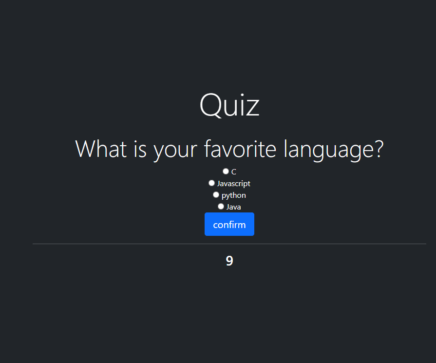

# JavaScript Quiz

## Description

A quick JavaScript Quiz to test your knowledge and compare scores with your peers! When you press the start button the timer starts and you have 10 seconds to answer four questions. If you answer a question wrong then time will be deducted. At the end you will be given a form to put your initials to store that alongside your highscore.

### Skills Used

In this assignment I used a function to toggle display on elements depending on button clicks (addEventListener) to make the flow of the quiz make sense. I also used a seperate JavaScript file to store an array of questions and in the initial file I have a for loop to cycle through all the questions. To collect the answers for the questions I used the radio form and assigned correct answers. The timer which displays at the bottom after you click start is stored in a function and counts down by 1 using setInterval(). I then used another form to collect user information to store highscores in local storage and display them on the page.

## Installation

Install locally with:
```
git clone https://github.com/larsly/JavaScript-Quiz
```

## Usage

To view the live website go to [https://larsly.github.io/JavaScript-Quiz/](https://larsly.github.io/JavaScript-Quiz/)



## Credits

N/A

## License

Please refer to the LICENSE in the repo.
